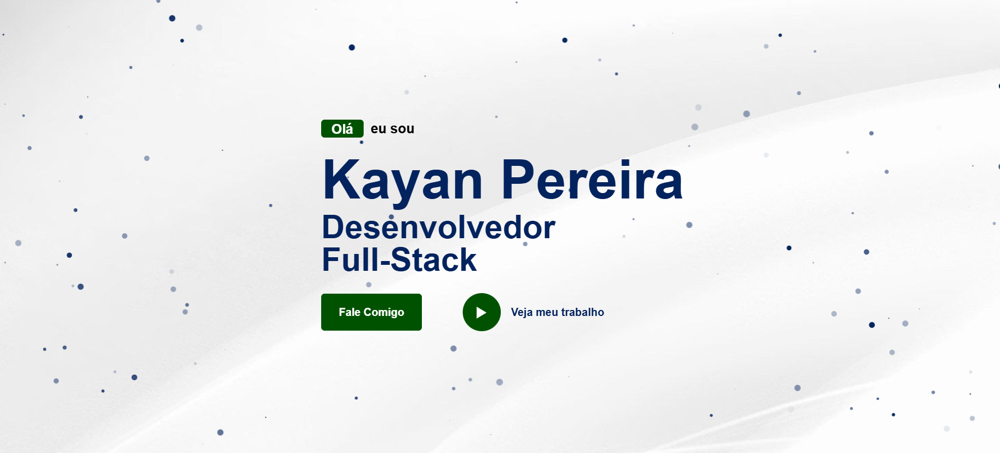

# Portfólio de Kayan Pereira

Bem-vindo ao repositório do meu portfólio! Este projeto é uma representação visual e funcional do meu trabalho como desenvolvedor Full-Stack.

## Visual do Portfólio

Aqui está uma captura de tela do Portfólio:




## Índice

1. [Descrição](#descrição)
2. [Tecnologias Utilizadas](#tecnologias-utilizadas)
3. [Funcionalidades](#funcionalidades)
4. [Seções do Portfólio](#seções-do-portfólio)
5. [Como Rodar o Projeto](#como-rodar-o-projeto)
6. [Contato](#contato)

---

## Descrição

Este portfólio foi desenvolvido para exibir minhas habilidades, experiências e projetos realizados. Ele inclui informações sobre minha formação acadêmica, experiência profissional e alguns dos projetos mais significativos nos quais trabalhei.

---

## Tecnologias Utilizadas

- **HTML5**: Para a estrutura do site.
- **CSS3**: Para estilização e responsividade.
- **JavaScript**: Para funcionalidades dinâmicas.
- **AOS (Animate On Scroll)**: Para animações responsivas durante o scroll.
- **Particles.js**: Para efeitos visuais interativos no background.
- **Google Fonts**: Fontes personalizadas (Lacquer e Roboto).

---

## Funcionalidades

- **Design Responsivo**: Adaptado para diferentes tamanhos de tela.
- **Animações com Scroll**: Efeitos visuais ao navegar pela página.
- **Links para Redes Sociais**: Conexão direta com LinkedIn e GitHub.
- **Download de Currículo**: Opção para baixar meu currículo em PDF.
- **Seção de Projetos**: Exibição dos últimos projetos realizados.

---

## Seções do Portfólio

### Home
- Introdução com meu nome, cargo e link para contato.
- Botão "Fale Comigo" com acesso direto ao WhatsApp.

### Sobre Mim
- Foto de perfil.
- Breve descrição sobre minhas habilidades e experiência.
- Links para LinkedIn, GitHub e currículo.

### Histórico Acadêmico
- Lista de cursos realizados com detalhes sobre datas, instituições e stacks utilizadas.

### Projetos
- Galeria com os últimos projetos realizados.
- Links para visualização dos projetos.

---

## Como Rodar o Projeto

### Passos

1. Clone este repositório:
   ```bash
   git clone https://github.com/Kayan33/portfolio.git
   ```

2. Navegue até o diretório do projeto:
   ```bash
   cd portfolio
   ```

3. Abra o arquivo `index.html` no navegador ou utilize um servidor local para melhor experiência.

4. Navegue pelo portfólio e explore as seções!

---

## Contato

- **Nome**: Kayan Pereira
- **WhatsApp**: [Clique aqui para enviar uma mensagem](https://wa.me/5514996839263)
- **LinkedIn**: [Perfil no LinkedIn](https://www.linkedin.com/in/kayan-pereira/)
- **GitHub**: [Repositórios no GitHub](https://github.com/Kayan33)
- **Currículo**: [Baixe meu currículo](https://drive.google.com/uc?export=download&id=1cl8D77OSyxUDwEf9II64A8xIomDhW5SI)

---

Obrigado por visitar meu portfólio! Fique à vontade para entrar em contato ou explorar meus projetos.

